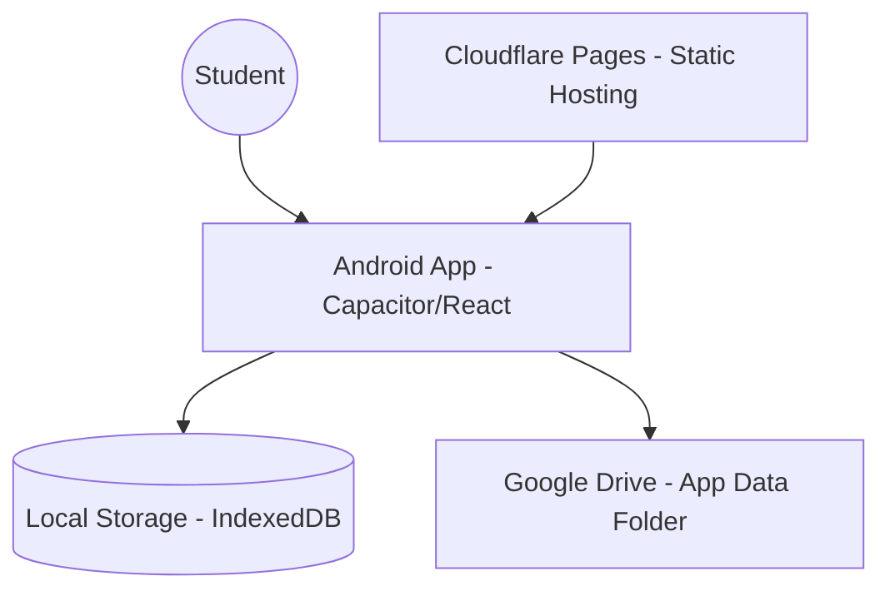

# System Context & Architecture: Homework Hero

## High-Level Architecture

## Component Breakdown
1.  **Mobile Client (React/Capacitor):**
    - Handles UI/UX (Modern Playful Design).
    - Manages local state via Local Storage / IndexedDB (Guest Mode).
    - Integrates with Google Drive API for optional cloud backup.
    - Integrates with Android native features via Capacitor plugins.

## Architecture Notes
- **Local-First:** All data is primarily stored on the device to ensure offline functionality and privacy.
- **Guest Mode:** Initial experience requires zero authentication.
- **Decentralized Sync:** Google Drive's "App Data Folder" is used for backup, ensuring zero server costs and maximum user data ownership.
- **Security:** OAuth 2.0 is used to authorize access to the user's private Drive folder.
